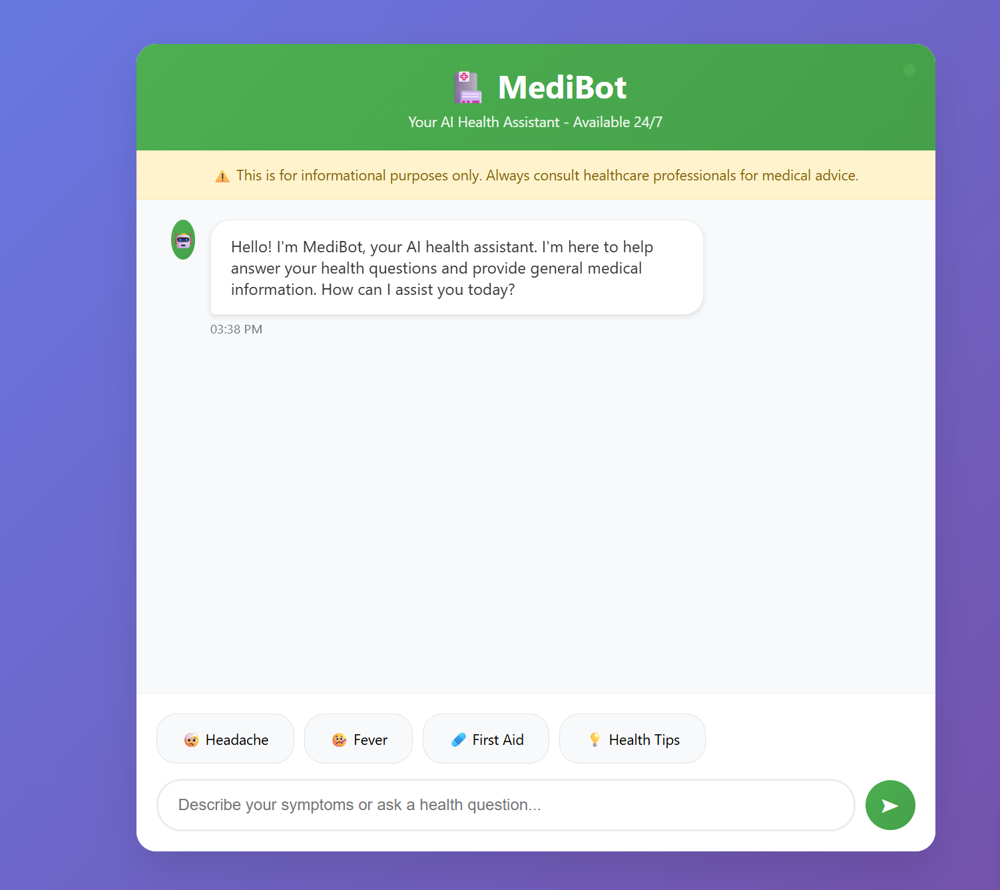

# 🩺 AI-Health-Diagnosis-Assistant (Generative AI)

A full-stack **AI-powered medical assistant** that uses a trusted medical book as the knowledge base, performs **semantic search** with Pinecone, and runs **LLaMA 3 locally** for inference - **no OpenAI API needed**.

---

## 🚀 Features

* 📚 Upload medical PDF(s) as your knowledge base
* 🧠 Chunk and embed using **MiniLM (`all-MiniLM-L6-v2`)**
* 🔍 Perform **semantic search** with Pinecone
* 🤖 Use **local LLaMA 3** model for private, offline inference
* 💬 Chat interface with **memory** using LangChain

---

## 🧰 Tech Stack

* **LLM**: Local **LLaMA 3** (run via `llama.cpp`, `text-generation-webui`, or API endpoint)
* **Embedding Model**: `sentence-transformers/all-MiniLM-L6-v2`
* **Vector DB**: Pinecone
* **Frontend**: Streamlit
* **Framework**: LangChain (Retrieval-Augmented Generation)
* **PDF Parsing**: PyPDF2
* **Environment Config**: `python-dotenv`

---

## 📦 Installation Steps

### 1. Clone the repository

```bash
git clone https://github.com/farhanaliarshad1/AI-Health-Diagnosis-Assistant.git
cd AI-Health-Diagnosis-Assistant
```

### 2. Create and activate virtual environment

```bash
python -m venv .venv
source .venv/bin/activate     # On Windows: .venv\Scripts\activate
```

### 3. Install dependencies

```bash
pip install -r requirements.txt
```

### 4. Set up environment variables

Create a `.env` file in the root directory:

```
PINECONE_API_KEY=************
PINECONE_ENV=************
# No OpenAI key required!
```

---

## 🦙 Set Up Local LLaMA 3

* Download and configure **LLaMA 3** model weights locally
* Use any local inference method (e.g. `llama.cpp`, `text-generation-webui`, or `transformers` server)
* use your local LLaMA endpoint instead of OpenAI

---

## 🧠 Index Your PDF Documents

Run the script to embed and upload PDF content to Pinecone:

```bash
python add_store_index.py
```

---

## ▶️ Run the App

```bash
streamlit run app.py
```

Then open [http://localhost:8080/](http://localhost:8080/) in your browser.

---

## 🔍 How It Works

1. **Upload** your PDF medical documents
2. **Extract and chunk** text using LangChain's `CharacterTextSplitter`
3. **Embed** using `all-MiniLM-L6-v2` (fast and accurate)
4. **Store** embeddings in Pinecone
5. **Retrieve** relevant chunks based on user query
6. **Generate responses** with context via **local LLaMA 3**
7. **Display conversation** in a friendly Streamlit chat UI

---

## 📋 Requirements

```
streamlit
langchain==0.1.14
sentence-transformers==2.2.2
transformers
torch
PyPDF2
python-dotenv
pinecone-client
faiss-cpu
```

---
## 📋 Frontend Screenshot




---

## 🪪 License & Credits
* Licensed under the **MIT License**

---

You're good to go 

